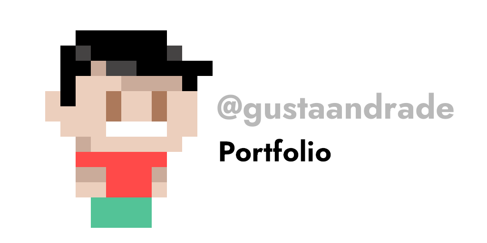
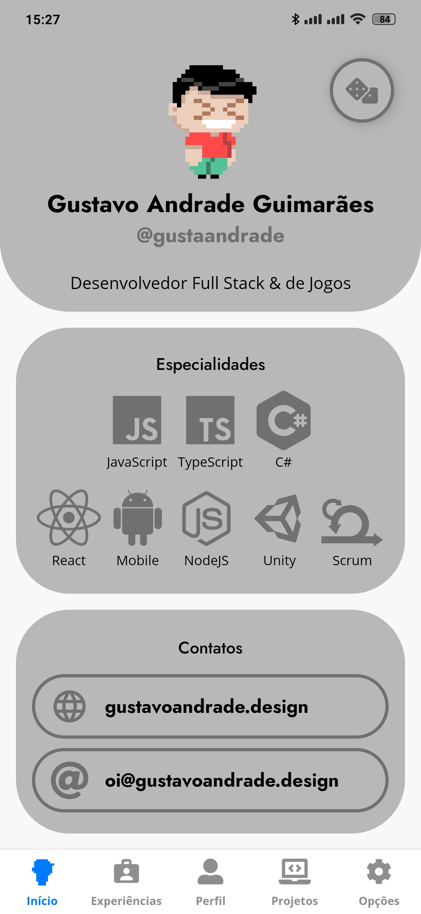
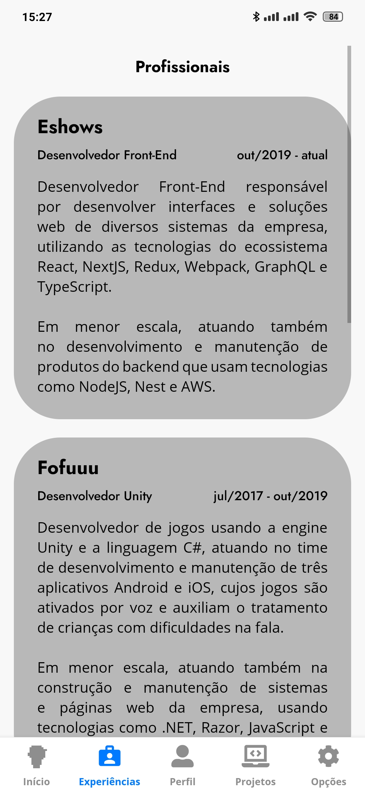
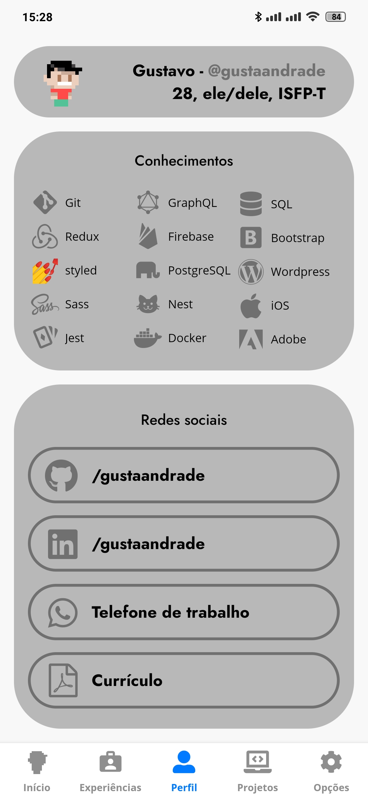
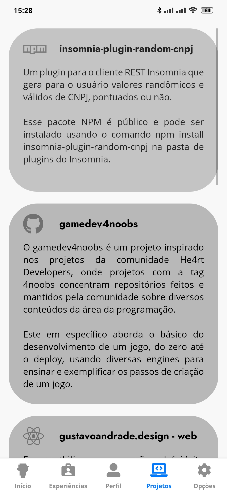
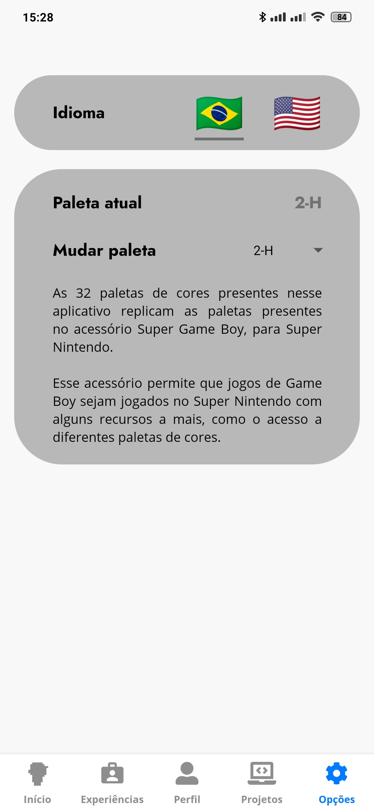

# [gustavoandrade.design](https://gustavoandrade.design)

  

  
  &emsp;
  

 

Este repositório contém os códigos-fonte para as versões web e mobile do meu novo portfólio, [gustavoandrade.design](https://gustavoandrade.design).

## Design

Meu último portfólio - ainda presente em [gustaandrade.github.io](https://gustaandrade.github.io) - foi feito em HTML5, CSS3 e JQuery. A inspiração do visual, se não ficou muito claro, era imitar a interface do Visual Studio, com _breakpoints_ e tudo. Ele é relativamente bonito, mas peca bastante quando o assunto é legibilidade e responsividade.

Um bom tempo se passou e agora, que já tenho um conhecimento bem maior em React, ficou claro que o portfólio tava precisando de uma repaginada, tanto pra corrigir os problemas que estavam claros, mas também pra poder estudar novas ferramentas ou tecnologias pra poder aplicá-las na construção dele. E porque não de quebra também fazer uma versão mobile em React Native né?

Um dessas ferramentas que permiti me aperfeiçoar é a `styled-components`, então resolvi que ela seria parte desse novo portfólio, uma vez que desde que a conheci pela primeira vez, não tive tempo suficiente para testá-la de fato. Além disso, sempre foi um desejo pessoal também internacionalizar o portfólio, ao menos para o inglês, e pra isso sei a biblioteca `i18next`.

Com as principais bibliotecas decididas, faltava o visual. Após bastante indecisão sobre como seria o layout, a decisão final começou a ser tomada quando lembrei do funcionamento do dispositivo Super Game Boy pra Super Nintendo e a presença de [diversas paletas de cores](https://www.mariowiki.com/Super_Game_Boy#Color_palettes) que deixavam os jogos de Game Boy, que não possuiam cores, coloridos.

Que tal usar a possibilidade de troca de temas através do `styled-components` e implementar um visual que permita a exibição dessas 32 paletas, e de quebra trazer um pouquinho de videogame para o portfólio?

## Web

  

 

A versão web foi feita em React, usando `create-react-app` e `TypeScript` como ferramentas iniciais do desenvolvimento.

A biblioteca `styled-components` foi usada para a construção do visual principal, e para a realização da troca das 32 paletas de cores, enquanto que a biblioteca `i18next` foi usada para a internacionalização dos textos da página. E bastante flexbox.

## Mobile

  
  &nbsp;
  
  &nbsp;
  
  &nbsp;
  
  &nbsp;
  

 

Já a versão mobile foi feita usando `Expo` para a construção e publicação mobile, além é claro da utilização em comum à versão web das bibliotecas `styled-components` e `i18next`.

O aplicativo deve ser publicado na Play Store em breve, mas enquanto não está lá, [pode ser baixado para Android nesse link](https://drive.google.com/file/d/1cB4G1yrXZ7WZG8AFje9A_nwyQ2fFBbHM/view?usp=sharing).

## Futuro

O resultado final da experiência completa ficou bem legal na minha opinião, mas sempre há o que melhorar. O intuito é continuar aprimorando esse repositório conforme novos projetos forem nascendo e conforme novas tecnologias forem despertando o interesse.

Tudo isso foi feito com bastante empenho e carinho. :yellow_heart:

## Licença

[MIT](./LICENSE)
